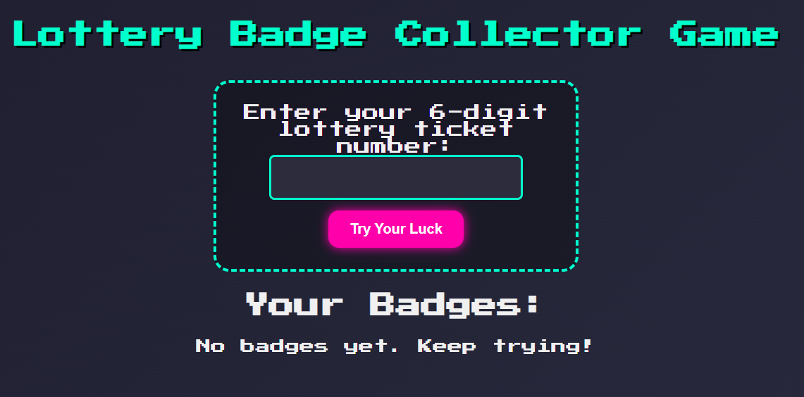

# 🎟️ Lottery Badge Collector

A fun web game where users enter a "lottery number" — if it matches the lucky number, they collect **badges**! Each match gets harder, and you can track how many badges you’ve won.

> Built with Flask, HTML/CSS, and a sprinkle of random luck 🍀

---

## 🚀 Features

- 🎲 Enter any number between 1–9999
- 🔁 Random lucky number generation
- 🏅 Badge collection for each match
- 🎮 Game-style UI with animations
- 🔄 Persistent badge count (in session)
- 🧠 Probability decreases as you win more

---

# 🎟️ Lottery Badge Collector

A fun web game where users enter a "lottery number" — if it matches the lucky number, they collect **badges**! Each match gets harder, and you can track how many badges you’ve won.

> Built with Flask, HTML/CSS, and a sprinkle of random luck 🍀

## 🚀 Features

- 🎲 Enter any number between 1–9999
- 🔁 Random lucky number generation
- 🏅 Badge collection for each match
- 🎮 Game-style UI with animations
- 🔄 Persistent badge count (in session)
- 🧠 Probability decreases as you win more

## 📸 Preview

 <!-- Optional: Add your own preview image -->

## 🛠️ How to Run Locally

1. **Clone the repo**
   ```bash
   git clone https://github.com/st23652/lottery-badge-collector.git
   cd lottery-badge-collector
   ```
2. **Create and activate virtual environment**
   ```bash
   python -m venv venv
   venv\Scripts\activate  # On Windows
   ```
3. **Install dependencies**
   ```bash
   pip install -r requirements.txt
   ```
4. **Run the app**
   ```bash
   python app.py
   ```
5. **Visit 👉 http://127.0.0.1:5000 in your browser**

## 🔧 Tech Stack
- Python + Flask
- HTML5/CSS3
- JavaScript (minimal)
- Random module


